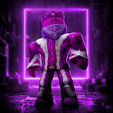
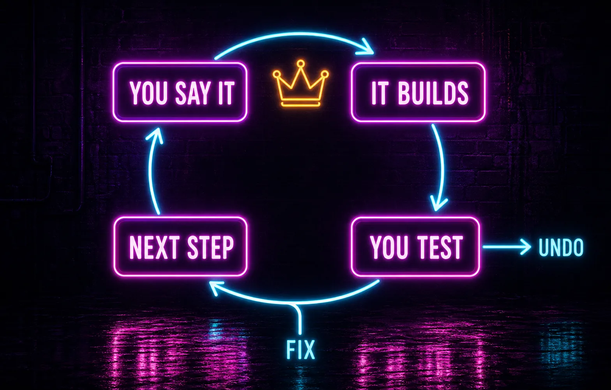
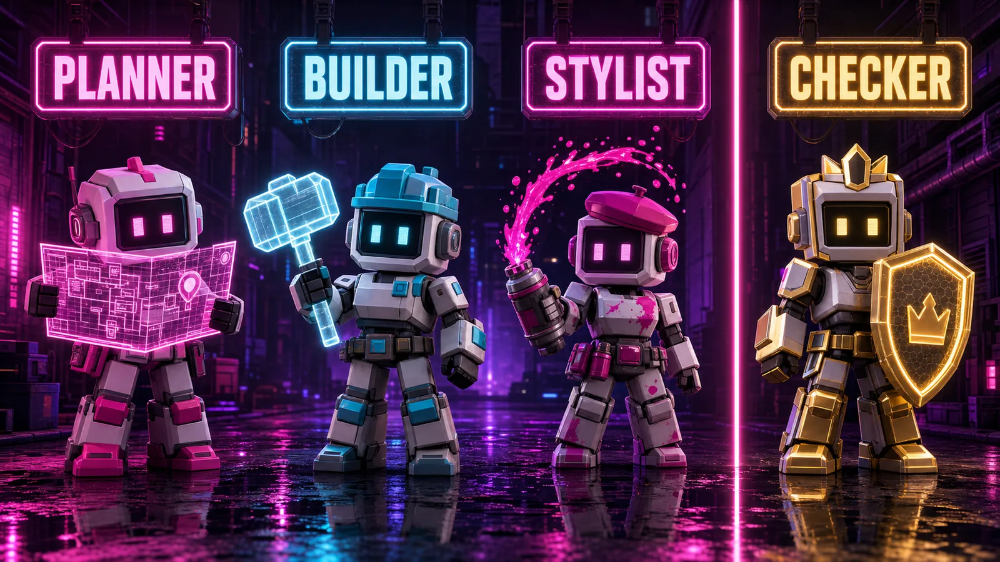
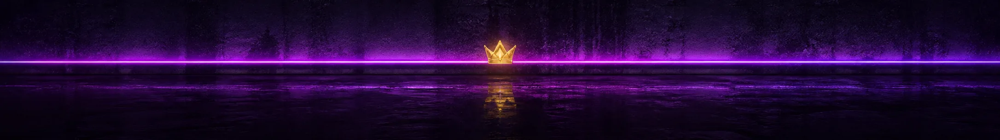
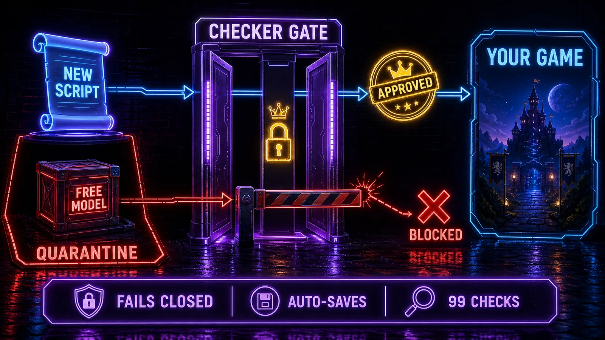

<div align="center">

# 👑 Mad Yoke's Roblox Game Builder



**You talk. It builds. You play it.**

**Talk to build** · **Every script checked** · **Designed for ~€20/month**

[How it works](#how-it-works) · [Parents — start here](#parents--start-here)

</div>

---

## What this is

This is my game studio. I tell Claude what I want — a lava obby, a tycoon, a pet that follows me — and a crew of four AI agents builds it in Roblox Studio, one step at a time. I never touch code, a terminal, or a config file. Every script gets crown-checked before it can run in my game.

## How it works

One step at a time. That's the rule.

`/build` makes the next piece — just one, so you always know what changed. The checker stamps it with the crown, or it never reaches Studio. Then `/test`: jump into Roblox Studio, play it, tick the step off. Repeat until it's a game.

<div align="center">

</div>

*The loop: one step, one crown, one play-test. Repeat.*

**Example** — what a step looks like (illustrative, not a real transcript):

```text
You:      /build
Builder:  Step 4 of 9 — spinning coins that vanish when you grab them.
Checker:  Script reviewed. Approved 👑 — sent to Studio.
You:      /test
          (in Studio) Coins spin. Grabbed one — gone. Step 4 done.
```

## The crew

Four agents. Each does one job.

- **`game-planner`** — turns your idea into a plan of small steps.
- **`builder`** — writes the Luau code for one step.
- **`stylist`** — the looks: UI, colours, lighting, the style sheet.
- **`checker`** — reviews **every** script before it can reach Studio.

The one who writes the code never reviews it. The checker never builds. That's the whole trick.

And the gold crown is the checker's stamp — and Mad Yoke's mark. Same crown. That's on purpose.

<div align="center">

</div>

*game-planner · builder · stylist — and the checker, holding the crown.*

## What you can build

**Tags are honest:** **Built** = shipped in a real game, shown with a real capture · **Recipe-supported** = the recipes and skill packs are ready for it · **Planned** = on the list. No fake screenshots here — nothing wears the **Built** tag until it exists and gets a real capture. Right now the trophy shelf is empty and the toolbox is full.

- **Classics** — obbies · tycoons · simulators · round-based minigames — *Recipe-supported*
- **Your world** — collectible coins · pets & followers · NPCs & enemies · worlds & terrain — *Recipe-supported*
- **Game systems** — shops · daily rewards · saved progress · badges & game passes — *Recipe-supported*
- **Polish** — menus & GUIs · sounds & music — *Recipe-supported*

---

<div align="center">

</div>

## Parents — start here

The section above is his. This one is yours: what actually controls the AI-written code, what it costs, and what you have to do once.

### Is it safe?

The core control is an **enforcement gate inside Roblox Studio**: a script runs in the game **only if the checker agent approved it**. Approval is verified structurally *and* by SHA-256 hash at the Studio boundary — so a file that was swapped or hand-edited after review fails safe. The gate **fails closed**: nothing unapproved can run in the game.

Around that gate:

- **A destructive-command guard** on the tooling side.
- **Quarantine for Toolbox free models** — anything pulled from the Toolbox lands in a quarantine area with its scripts disabled, and is scanned before anything runs.
- **Invisible local auto-save** — git under the hood; he never sees that word. `/undo` is its only face and restores his *code and plan* to an earlier save. (Hand-placed Studio objects are covered by Studio's own undo and version history instead.)
- **A 99-check test suite** exercises this machinery, and the system has been **independently security-reviewed**.

> **The boundary.** These controls protect the *build pipeline* — what AI-written code can do inside his game. They do not replace Roblox's own account, chat, privacy and spending controls, and they don't replace your supervision.

<div align="center">

</div>

*The gate: crown-approved scripts pass; anything unapproved stops, in red.*

### What it costs

Designed to run on a **~€20/month Claude Pro plan**. It stays inside that on purpose: Sonnet by default with Opus reserved for planning, a two-file memory instead of a sprawling context, one build step at a time — and gentle "take a break" nudges, which are as much for the kid as for the token budget.

### One-time setup

Honest version: the install needs a technical adult, and it's done once. After that, his side is just talking.

- **[SETUP.md](SETUP.md)** — your one-time install, start to finish.
- **[HOW-TO-USE.md](HOW-TO-USE.md)** — his one-page manual.
- **`/checkup`** — your command afterwards: a health report plus a Studio setup check, any time you want to see the state of things.

---

<div align="center">

</div>

## The commands

Eight for the player. One for the parent. The rhythm is **`/build` → `/test`**.

| Purpose | Command | What it does |
|---|---|---|
| Start something | `/newgame` | Your idea becomes a plan of small steps, plus a style |
| The rhythm | `/build` | Builds the next **one** step |
| | `/test` | Play it in Studio, tick the step |
| When it breaks | `/fix` | Diagnoses and repairs |
| | `/undo` | Rewinds to an earlier save, in plain words |
| Ship it | `/publish` | Guided Studio publish |
| Learn | `/peek` | Explains the newest script, one idea at a time (opt-in) |
| | `/help` | The menu |

| For the parent | Command | What it does |
|---|---|---|
| Check on things | `/checkup` | Health report + Studio setup check |

## The 11 skill packs

The crew's reference library — loaded by whichever agent needs it.

- **Build** — `roblox-luau-basics` · `roblox-game-recipes`
- **Look & Feel** — `roblox-gui-basics` · `roblox-sound-and-music` · `roblox-worlds-and-terrain`
- **Game Systems** — `roblox-npcs-and-enemies` · `roblox-player-data` (saving progress) · `roblox-badges-and-passes` · `roblox-safe-scripting`
- **Learn & Fix** — `roblox-fix-recipes` · `roblox-code-peek`

---

<div align="center">

</div>

## What Mad Yoke's building next

This space is his. The first game to ship gets its **Built** tag and a real capture right here — no mock-ups, no placeholders pretending to be gameplay. Watch this space.

<div align="center">

**Set up by Dad · Built with Claude · Ruled by Mad Yoke 👑**

<sub>This version was designed through a multi-advisor pipeline and independently security-reviewed.</sub>

</div>
